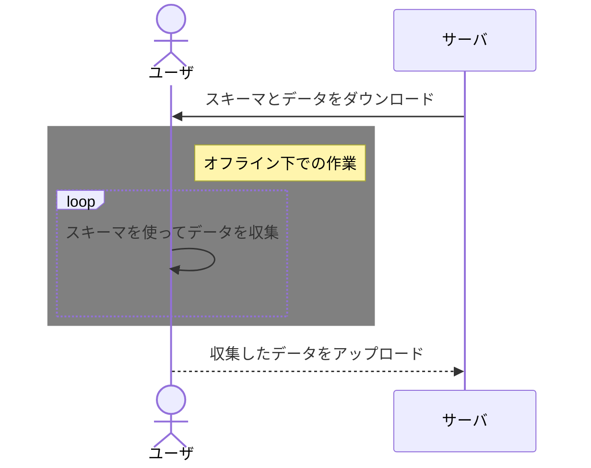
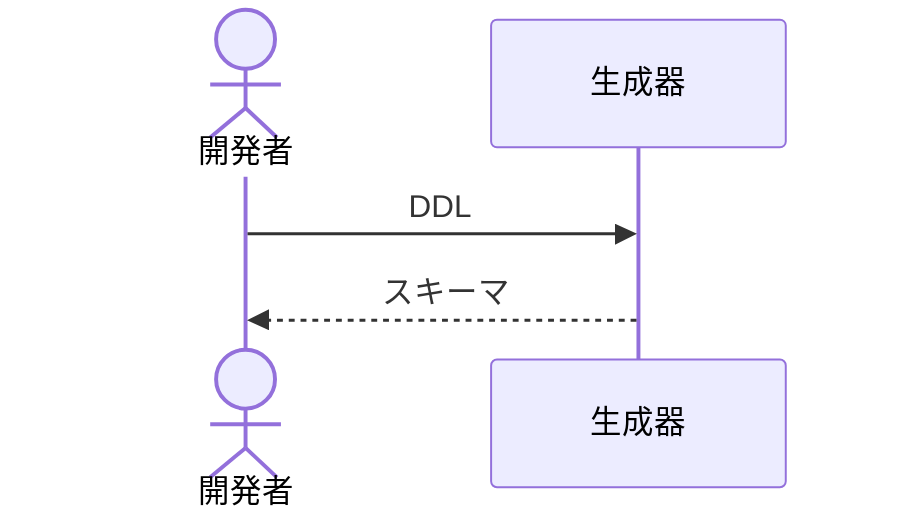

# EXTRACT_SCHEMA.PSM

EXTRACT_SCHEMA.PSMは、RDBのオブジェクト定義からテキストデータスキーマを生成します。

## README Language

- [英語(English)](./README.md)
- [日本語](./README.ja-jp.md)

## 特徴

### データベース ネイティブ

EXTRACT_SCHEMA.PSMは永続格納モジュール(ストアドプロシージャ/ファンクションの名で知られています)で記述されています。

もしPaaSのRDMBSを使用する場合でも、ランタイム用サーバを用意する必要はありません。

### データベース共通のインターフェースと書式

EXTRACT_SCHEMA.PSMは異なるRDBMS間で統一されたインターフェースと書式を目指しています。

RDBMSの変更をする際に、コンバージョンにかかる負荷が低減できるかもしれません。

## 使用例

### オフラインの複製データとして使用する

もしアプリがオフライン下で使用される場合、生成したスキーマをオフラインの複製データとして使用できます。

### スキーマコーディング補助ツールとして

アプリケーションが常にオンラインで使用できるとしても、スキーマでのバリデーションはアプリケーションの品質において多くの利点があります。しかし、多くの開発者にとってスキーマのコーディングは面倒で、DDLはいくらか簡単です。

スキーマのコーディング補助に使用しても良いかもしれません。(例:[ddl-to-schema.docker](https://github.com/telitas/ddl-to-schema.docker))

## 実装

現在、標準SQLの既定義データ型のみ対応しています。

|   RDBMS  |XML|JSON(preview)|                      プロジェクトサイト                      |
|----------|:-:|:--:|--------------------------------------------------------|
|PostgreSQL| ✔ | ✔  |https://github.com/telitas/EXTRACT_SCHEMA.PSM-postgresql|
|MySQL     | - | ✔  |https://github.com/telitas/EXTRACT_SCHEMA.PSM-mysql     |

## 今後の予定

- 他RDBの実装(Oracle, SQL Server)
- 構成型・ユーザ定義型の対応

## License

MIT

Copyright (c) 2022 telitas

See the LICENSE file or https://opensource.org/licenses/mit-license.php for details.
