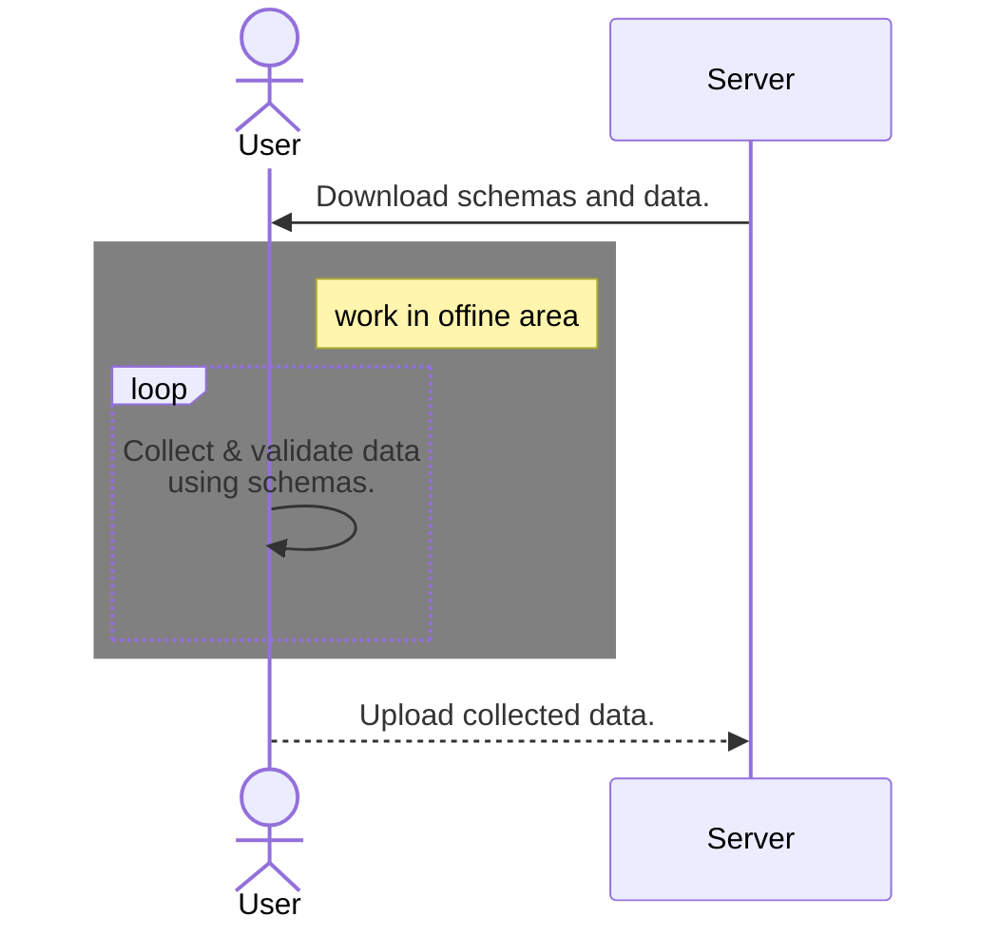
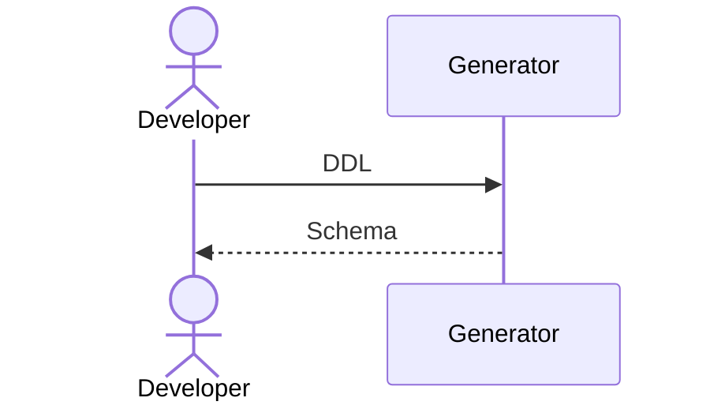

# EXTRACT_SCHEMA.PSM

EXTRACT_SCHEMA.PSM generates text data schemas from RDB object definitions.

## README Language

- [English](./README.md)
- [Japanese(日本語)](./README.ja-jp.md)

## Characteristics

### Database native

EXTRACT_SCHEMA.PSM is written in Persistent Stored Modules(a.k.a Stored Procedures/Functions).

If you use a PaaS RDBMS, you do not need to prepare a server for runtime.

### Cross-database interface and format

EXTRACT_SCHEMA.PSM aims for a unified interface and format between different RDBMSs.

When migrating RDBMS, you may be able to convert programs with minimum effort.

## Usecase

### As offline data replication

If the users must use your application in offline, the generated schemas can be used as offline data replication.

### As schema coding assist tool

Even if the applcation is always used in online, schema validation has many advantages in application quality. But coding the schema is bothersome and DDL is more easier for many developers.

You may use it to assist coding the schema.(Example:[ddl-to-schema.docker](https://github.com/telitas/ddl-to-schema.docker))

## Implements

Currently, it only supports Standard SQL predefined data type.

|   RDBMS  |XML|JSON(preview)|                      Project site                      |
|----------|:-:|:--:|--------------------------------------------------------|
|PostgreSQL| ✔ | ✔  |https://github.com/telitas/EXTRACT_SCHEMA.PSM-postgresql|
|MySQL     | - | ✔  |https://github.com/telitas/EXTRACT_SCHEMA.PSM-mysql     |

# Roadmap

- implement in other RDB(Oracle, SQL Server)
- supprot constructed type and user-defined type.

## License

MIT

Copyright (c) 2022 telitas

See the LICENSE file or https://opensource.org/licenses/mit-license.php for details.
